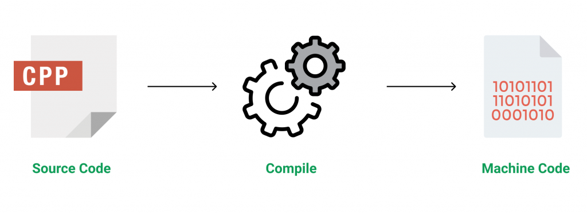

# Introduction to C++ Programming Language

#### C++ is a general-purpose programming language that was developed as an enhancement of the C language to include object-oriented paradigm. It is an imperative and a compiled language


<ol>
<li>
C++ is a high-level, general-purpose programming language designed for system and application programming. It was developed by Bjarne Stroustrup at Bell Labs in 1983 as an extension of the C programming language. C++ is an object-oriented, multi-paradigm language that supports procedural, functional, and generic programming styles.
</li>

<li>One of the key features of C++ is its ability to support low-level, system-level programming, making it suitable for developing operating systems, device drivers, and other system software. At the same time, C++ also provides a rich set of libraries and features for high-level application programming, making it a popular choice for developing desktop applications, video games, and other complex applications.</li>

<li>C++ has a large, active community of developers and users, and a wealth of resources and tools available for learning and using the language. Some of the key features of C++ include: </li>

<li>Object-Oriented Programming: C++ supports object-oriented programming, allowing developers to create classes and objects and to define methods and properties for these objects.</li>

<li>Templates: C++ templates allow developers to write generic code that can work with any data type, making it easier to write reusable and flexible code.</li>

<li>Standard Template Library (STL): The STL provides a wide range of containers and algorithms for working with data, making it easier to write efficient and effective code.</li>

<li>Exception Handling: C++ provides robust exception handling capabilities, making it easier to write code that can handle errors and unexpected situations.</li>
</ol>

```cpp
#include <iostream>

int main() {
    std::cout << "Hello, World!" << std::endl;
    return 0;
}
```



<br>

### Applications of C++: 

- Operating Systems & Systems Programming. e.g. Linux-based OS (Ubuntu etc.)
- Browsers (Chrome & Firefox)
- Graphics & Game engines (Photoshop, Blender, Unreal-Engine)
- Database Engines (MySQL, MongoDB, Redis etc.)
- Cloud/Distributed Systems
