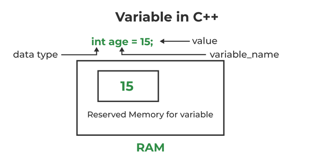

# Variables
#### A variable provides us with named storage that our programs can manipulate. Each variable in C++ has a specific type, which determines the size and layout of the variable's memory; the range of values that can be stored within that memory; and the set of operations that can be applied to the variable.

## Rules For Naming Variable
### The names given to a variable is called identifiers. There are some rules for giving a name to the variable:

- The name of the variable contains letters, digits, and underscores.
- The name of the variable is case sensitive (e.g. Arr and arr both are different variables).
- The name of the variable does not contain any whitespace and special characters (ex #, $, %, *, etc).
- All the variable names must begin with a letter of the alphabet or an underscore (_).
- We cannot used C++ keyword (e.g. float, double, class) as a variable name.


## Examples of Variables

### Store Data in a Variable and Print It
```cpp
#include <iostream>
using namespace std;

int main() {

    // Defining and initializing a variable
      int age1 = 15;
  
      // Defining a variable
      int age2;
  
      // Initialize the variable
      age2 = 99;
  
      // Displaying variable
      cout << age1 << endl;
      cout << age2;
    return 0;
}
```

### Create Multiple Variables at Once
```cpp
#include <iostream>
using namespace std;

int main() {
  
      // Creating three variables that store characters
      char a = 'A', b = 'B', c = 'C';
  
      // Update the value
      c = 'c';

    cout << a << " " << b << " " << c;
    return 0;
}
```



### Memory Management of Variables

- When a variable is declared, the compiler is told about the variable name and the type of data it will store. It is not allocated the any memory at this point. It is when the variable is defined it is allocated the memory. The amount of memory allocated depends upon the type of data that a variable intends to store.

- Initially, the variable only stores some garbage value (value that does not mean anything). At the time of initialization, it is assigned some meaningful value that using the assignment operator that is then stored in the memory allocated to the function. So basically, we are manipulating a specific part of memory using the variable name.