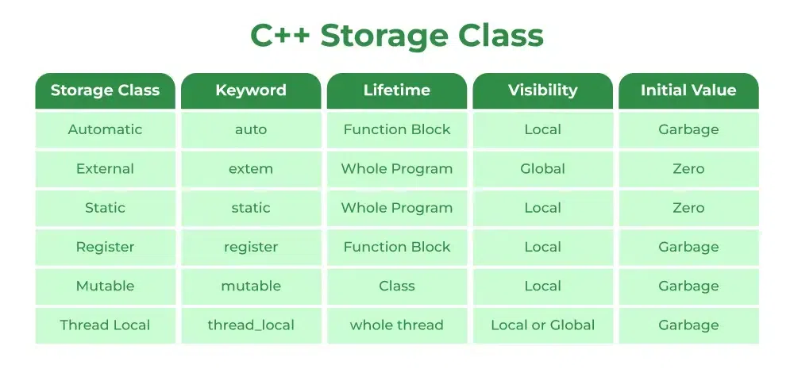

# Storage Classes

#### C++ Storage Classes are used to describe the characteristics of a variable/function. It determines the lifetime, visibility, default value, and storage location which helps us to trace the existence of a particular variable during the runtime of a program. Storage class specifiers are used to specify the storage class for a variable.

## 1. auto Storage Class
#### The auto storage class is the default class of all the variables declared inside a block. The auto stands for automatic and all the local variables that are declared in a block automatically belong to this class.

### Properties of auto Storage Class Objects
- Scope: Local
- Default Value: Garbage Value
- Memory Location: RAM
- Lifetime: Till the end of its scope

```cpp
#include <iostream>
using namespace std;

int main() {

    // Declaring an auto variable
    int a = 32;
    float b = 3.2;
    string c = "GeeksforGeeks";

    // Printing the auto variables
    cout << a << " \n";
    cout << b << " \n";
      cout << c << " \n";

    return 0;
}
```
---

## 2. extern Storage Class
#### The extern storage class simply tells us that the variable is defined elsewhere and not within the same scope (or even source file) where it is used (i.e. external linkage). Basically, the variable is created in a different scope or file and can be used in a different file as well.

#### A normal global variable can be made extern as well by placing the extern keyword before its declaration/definition in any function/block. The main purpose of using extern variables is that they can be accessed between two different files which are part of a large program.

### Properties of extern Storage Class Objects
- Scope: Global
- Default Value: Zero
- Memory Location: RAM
- Lifetime: Till the end of the program

```cpp
hello.cpp

// Defining a global variable with external linkage
int var = 10;
```

```cpp
main.cpp

#include <iostream>
using namespace std;

// Telling compiler that variable x is extern variable
// and has been defined elsewhere
extern int x;

int main() {
  
      // Printing the value of x
    cout << x;

    return 0;
}
```

---

## 3. static Storage Class
#### The static storage class is used to declare static variables that have the property of preserving their value even after they are out of their scope. They are initialized only once and exist until the termination of the program. Thus, no new memory is allocated because they are not re-declared. Global static variables can be accessed anywhere in the program but unlike extern variable, they have internal linkage so they cannot be accessed outside the program.

### Properties of static Storage Class
- Scope: Local
- Default Value: Zero
- Memory Location: RAM
- Lifetime: Till the end of the program

```cpp
#include <iostream>
using namespace std;

// Function containing static variables
// memory is retained during execution
int func() {
  
      // Static variable
    static int count = 0;
    count++;
    return count;
}

int main() {
    cout << func() << "\n";
    cout << func();
    
    return 0;
}
```
---

## 4. register Storage Class

#### The register storage class declares register variables using the register keyword which has the same functionality as that of the auto variables. The only difference is that the compiler tries to store these variables in the register of the microprocessor if a free register is available. This makes the use of register variables to be much faster than that of the variables stored in the memory during the runtime of the program. If a free register is not available, these are then stored in the RAM.

#### An important and interesting point to be noted here is that we cannot obtain the address of a register variable using pointers.

### Properties of register Storage Class Objects
- Scope: Local
- Default Value: Garbage Value
- Memory Location: Register in CPU or RAM
- Lifetime: Till the end of its scope

```cpp
#include <iostream>
using namespace std;

int main() {

    // Declaring a register variable
    register char b = 'G';

    // Printing the register variable 'b'
    cout << b;
  
    return 0;
}
```
---

## 5. mutable Storage Class

#### Sometimes there is a requirement to modify one or more data members of class/struct through the const function even though you don’t want the function to update other members of class/struct. This task can be easily performed by using the mutable keyword. The keyword mutable is mainly used to allow a particular data member of a const object to be modified. 

#### When we declare a function as const, this pointer passed to the function becomes const. Adding a mutable to a variable allows a const pointer to change members.

### Properties of mutable Storage Class
The mutable specifier does not affect the linkage or lifetime of the object. It will be the same as the normal object declared in that place.

```cpp
#include <iostream>
using namespace std;

class A {
public:
    int x;

    // Defining mutable variable y
    // now this can be modified
    mutable int y;

    A(): x(4), y(10) {}
};

int main() {
  
    // a is created as constant
    const A a;

    // Trying to change the value
    a.y = 200;
    cout << a.y;

    // Uncommenting below lines
    // will throw error
    /* a.x = 8;
    cout << a.x; */
  
    return 0;
}
```
---

## 6. thread_local Storage Class

#### The thread_local Storage Class is the new storage class that was added in C++11. We can use the thread_local storage class specifier to define the object as thread_local. The thread_local variable can be combined with other storage specifiers like static or extern and the properties of the thread_local object changes accordingly.

### Properties of thread_local Storage Class

- Memory Location: RAM
- Lifetime: Till the end of its thread

```cpp
#include <iostream>
#include <mutex>
#include <thread>

using namespace std;

// Defining thread-local variable
thread_local int val = 10;

// Mutex for synchronization
mutex mtx;

int main() {
  
    // Created 3 threads
    // Modify value in thread 1
    thread th1([]() {
        val += 18;
        lock_guard<mutex> lock(mtx);
        cout << "Thread 1 value: " << val << '\n';
    });

    thread th2([]() {
      
        // Modify value in thread 2
        val += 7;
        lock_guard<mutex> lock(mtx);
        cout << "Thread 2 value: " << val << '\n';
    });

    thread th3([]() {
      
        // Modify value in thread 3
        val += 13;
        lock_guard<mutex> lock(mtx);
        cout << "Thread 3 value: " << val << '\n';
    });

    // Wait for all threads to finish
    th1.join();
    th2.join();
    th3.join();

    // Print the value of value in the main thread
    cout << "Main thread value: " << val << '\n';

    return 0;
}
```

