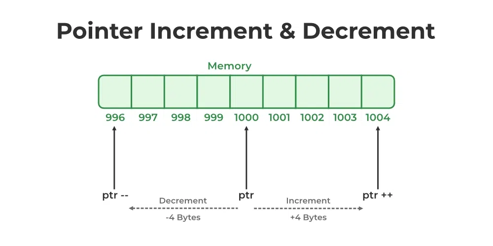
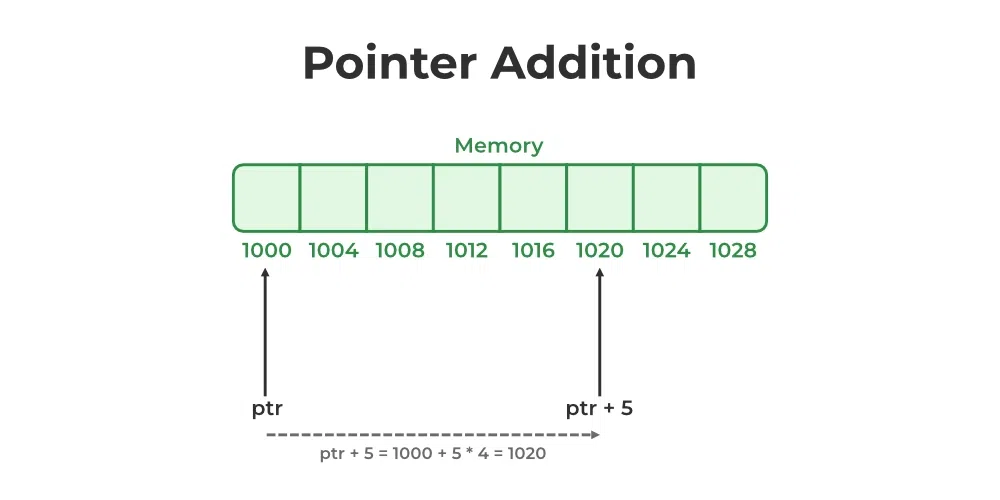
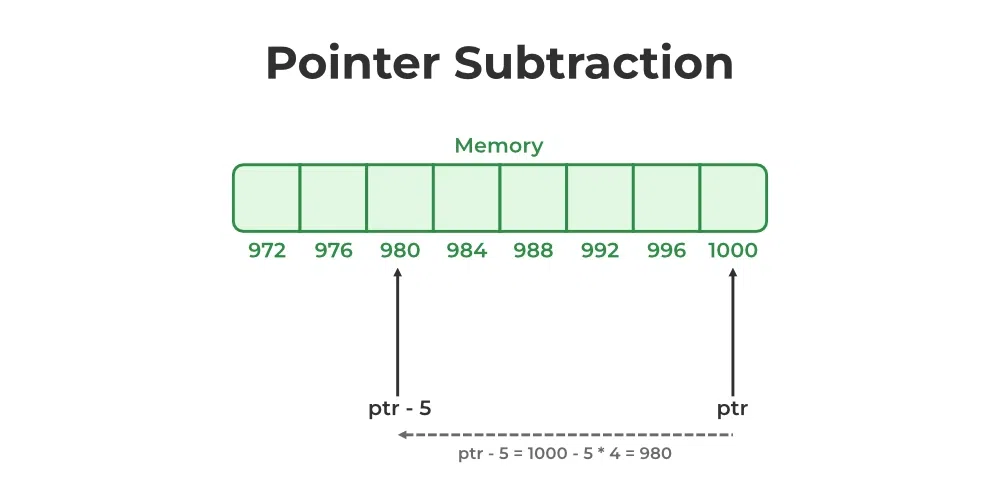

# Pointer Arithmetic

#### In C++, pointer arithmetic means performing arithmetic operations on pointers. It refers to the operations that are valid to perform on pointers. 

### Following are the arithmetic operations valid on pointers in C++:

- Incrementing and Decrementing Pointer in C++
- Addition of Constant to Pointers
- Subtraction of Constant from Pointers
- Subtraction of Two Pointers of the Same Datatype
- Comparison of Pointers


## 1. Incrementing and Decrementing Pointer in C++

Incrementing or decrementing a pointer will make it refer to the address of the next or previous data in the memory. This process differs from incrementing and decrementing numeric data. 

When we increment or decrement a numeric data, its value is incremented or decremented by 1. However, incrementing or decrementing a pointer, instead of increasing or decreasing by 1, the address increases or decreases by 1 multiplied by the size of the data type it is pointing to. (one of the reasons why the pointer declaration requires information about the type of data it is pointing to)

### Incrementing a Pointer
Incrementing a pointer will depend on the type of variable address stored in the pointer. For example, If a pointer ptr holds the address 1000 and we increment the pointer, then the pointer will be incremented by 4 or 8 bytes (size of the integer), and the pointer will now hold the address 1004.

```cpp
ptr++;
++ptr;
```

### Decrementing a Pointer
When we apply a decrement operation on the pointer then the pointer is decremented by 4 or 8 bytes depending upon the machine. For example, If a pointer ptr holds the address 1004 and we decrement the pointer, then the pointer will be decremented by 4 or 8 bytes (size of the integer), and the pointer will now hold the address 1000.

```cpp
ptr–-;
--ptr
```



```cpp
#include <iostream>
using namespace std;

int main() {

    int n = 27;
    
    // Storing address of n in ptr
    int* ptr = &n;

    // Print size of int
    cout << "Size of int: " << sizeof(int) << endl;

    // Print the address stored at ptr
    cout << "Before Increment: " << ptr << endl;
    
    // Increment pointer
    ptr++;
    cout << "After Increment: " << ptr << endl;

    // Print the address stored at ptr
    cout << "Before Decrement: " << ptr << endl;
    
    // Decrement pointer
    ptr--;
    cout << "After Decrement: " << ptr;

    return 0;
}
```

## 2. Addition of Constant to Pointers

We can add integer values to Pointers and the pointer is adjusted based on the size of the data type it points to. For example, if an integer pointer ptr stores the address 1000 and we add the value 5 to the pointer,

```cpp
ptr + 5
1000 + (5 * 4(size of an integer)) = 1020
```



```cpp
// CPP program to demonstrate the addition of a constant to
// a pointer
#include <iostream>
using namespace std;

int main()
{

    int n = 20;
    int* ptr = &n;

    cout << "Address stored in ptr: " << ptr << endl;

    // Adding the integer value 1 to the pointer ptr
    ptr = ptr + 1;
    cout << "Adding 1 to ptr: " << ptr << endl;

    // Adding the integer value 2 to the pointer ptr
    ptr = ptr + 2;
    cout << "Adding 2 to ptr: " << ptr;

    return 0;
}
```

## 3. Subtraction of Constant from Pointers

We can also subtract a constant from Pointers and it is the same as the addition of a constant to a pointer. For example, if an integer pointer ptr stores the address 1000 and we subtract the value 5 from the pointer:

```cpp
ptr – 5
1000 – (5 * 4(size of an integer)) = 980
```



```cpp
#include <iostream>
using namespace std;

int main()
{

    int n = 100;

    int* ptr = &n;

    cout << "Address stored in ptr: " << ptr << endl;

    // Subtracting the integer value 1 from pointer ptr
    ptr = ptr - 1;
    cout << "Subtract 1 from ptr: " << ptr;

    return 0;
}
```

## 4. Subtraction of Two Pointers of the Same Datatype

The Subtraction of two pointers can be done only when both pointers are of the same data type. The subtraction of two pointers gives the number of elements present between the two memory addresses so it is primarily valid if the two pointers belong to the same array.

For Example, in an array arr[10], ptr1 point points to the element at index 2 and ptr2 points to the element at index 4, then the difference between two pointers will give you the number of elements between them.

```cpp
ptr2 – ptr1
```

```cpp
#include <iostream>
using namespace std;

int main() {
    int arr[5] = {1, 2, 3, 4, 5};

    int* ptr1 = &arr[2];

    // Adding 4 to ptr1 and stored in ptr2
    int* ptr2 = &arr[4];

    // Subtracting ptr2 from ptr1
    cout << ptr2 - ptr1;

    return 0;
}
```


## 5. Comparison of Pointers

In C++, we can perform a comparison between the two pointers using the relational operators(>, <, >=, <=, ==, !=). We generally use this operation to check whether the two-pointer as pointing to the same memory location or not.

```cpp
#include <iostream>
using namespace std;

int main() {
    int n = 10;
    int* ptr1 = &n;
    int** ptr2 = &ptr1;
    int* ptr3 = *ptr2;

    // comparing equality
    if (ptr1 == ptr3) {
        cout << "Both point to same memory location";
    }
    else {
        cout << "ptr1 points to: " << ptr1 << endl;
        cout << "ptr3 points to: " << ptr3;
    }
    return 0;
}

```

## 6. Comparison to NULL

We can compare the pointer of a type to NULL. This operation helps us to find whether the given pointer points to some memory address or not. It helps us to control errors such as segmentation faults.

```cpp
#include <iostream>
using namespace std;

int main() {
    int n = 10;
  
    // Assigning null in case we dont use pointer
    int* ptr = NULL;
    ptr = &n;

    // Checking if the pointer is in use or not
    if (ptr == NULL) {
        cout << "No value is pointed";
    }
    else {
        cout << *ptr;
    }
    return 0;
}
```