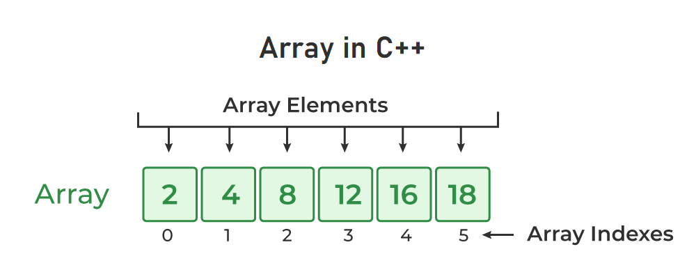

# Arrays

In C++, an array is a data structure that is used to store multiple values of similar data types in a contiguous memory location.



### Properties of Arrays in C++
- An Array is a collection of data of the same data type, stored at a contiguous memory location.
- Indexing of an array starts from 0. It means the first element is stored at the 0th index, the second at 1st, and so on.
- Elements of an array can be accessed using their indices.
- Once an array is declared its size remains constant throughout the program.
- An array can have multiple dimensions.
- The size of the array in bytes can be determined by the sizeof operator using which we can also find the number of elements in the array.
- We can find the size of the type of elements stored in an array by subtracting adjacent addresses.


```cpp
//  C++ Program to Illustrate How to Access Array Elements
#include <iostream>
using namespace std;

int main()
{

    int arr[3];

    // Inserting elements in an array
    arr[0] = 10;
    arr[1] = 20;
    arr[2] = 30;

    // Accessing and printing elements of the array
    cout << "arr[0]: " << arr[0] << endl;
    cout << "arr[1]: " << arr[1] << endl;
    cout << "arr[2]: " << arr[2] << endl;

    return 0;
}
```

```cpp
// C++ Program to Illustrate How to Traverse an Array
#include <iostream>
using namespace std;

int main()
{

    // Initialize the array
    int table_of_two[10]
        = { 2, 4, 6, 8, 10, 12, 14, 16, 18, 20 };

    // Traverse the array using for loop
    for (int i = 0; i < 10; i++) {
        // Print the array elements using indexing
        cout << table_of_two[i] << " ";
    }

    return 0;
}
```


```cpp
// C++ Program to Illustrate How to Find the Size of an
// Array
#include <iostream>
using namespace std;

int main()
{
    int arr[] = { 1, 2, 3, 4, 5 };

    // Size of one element of an array
    cout << "Size of arr[0]: " << sizeof(arr[0]) << endl;

    // Size of array 'arr'
    cout << "Size of arr: " << sizeof(arr) << endl;

    // Length of an array
    int n = sizeof(arr) / sizeof(arr[0]);

    cout << "Length of an array: " << n << endl;

    return 0;
}
```


```cpp
// C++ Program to Illustrate that Array Name is a Pointer
// that Points to First Element of the Array
#include <iostream>
using namespace std;

int main()
{
    // Defining an array
    int arr[] = { 1, 2, 3, 4 };

    // Define a pointer
    int* ptr = arr;

    // Printing address of the arrary using array name
    cout << "Memory address of arr: " << &arr << endl;

    // Printing address of the array using ptr
    cout << "Memory address of arr: " << ptr << endl;

    return 0;
}
```

### Different Ways to Pass Arrays to a Function

```cpp
#include <iostream>
using namespace std;

// passing array as a sized array argument
void printArraySized(int arr[3], int n)
{
    cout << "Array as Sized Array Argument: ";
    for (int i = 0; i < n; i++) {
        cout << arr[i] << " ";
    }
    cout << endl;
}

// passing array as an unsized array argument
void printArrayUnsized(int arr[], int n)
{
    cout << "Array as Unsized Array Argument: ";
    for (int i = 0; i < n; i++) {
        cout << *(arr + i) << " ";
    }
    cout << endl;
}

// Passing array as a pointer argument
void printArrayPointer(int* ptr, int n)
{
    // Print array elements using pointer ptr
    // that store the address of array passed
    cout << "Array as Pointer Argument: ";
    for (int i = 0; i < n; i++) {
        cout << ptr[i] << " ";
    }
}

// driver code
int main()
{

    int arr[] = { 10, 20, 30 };

    // Call function printArray and pass
    // array and its size to it.
    printArraySized(arr, 3);
    printArrayUnsized(arr, 3);
    printArrayPointer(arr, 3);

    return 0;
}
```