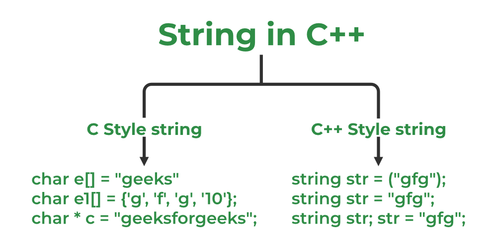

# Strings

#### C++ strings are sequences of characters stored in a char array. Strings are used to store words and text. They are also used to store data, such as numbers and other types of information. Strings in C++ can be defined either using the std::string class or the C-style character arrays.




## 1. C Style Strings
These strings are stored as the plain old array of characters terminated by a null character ‘\0’. They are the type of strings that C++ inherited from C language.

```cpp
// C++ Program to demonstrate strings
#include <iostream>
using namespace std;

int main()
{

    char s[] = "vertexlabs";
    cout << s << endl;
    return 0;
}
```

## 2. std::string Class
These are the new types of strings that are introduced in C++ as std::string class defined inside <string> header file. This provides many advantages over conventional C-style strings such as dynamic size, member functions, etc.

```cpp
// C++ program to create std::string objects
#include <iostream>
using namespace std;

int main()
{

    string str("vertexlabs");
    cout << str;
    return 0;
}
```

One more way we can make strings that have the same character repeating again and again.

```cpp
#include <iostream>
using namespace std;

int main()
{
    string str(5, 'g');
    cout << str;
    return 0;
}
```


## How to Take String Input

String input means accepting a string from a user. In C++. We have different types of taking input from the user which depend on the string. The most common way is to take input with cin keyword with the extraction operator (>>) in C++. Methods to take a string as input are:

- cin
- getline
- stringstream

### 1. Using Cin
The simplest way to take string input is to use the cin command along with the stream extraction operator (>>). 

```cpp
// C++ Program to demonstrate string input using cin
#include <iostream>
using namespace std;

int main() {

      string s;
      
    cout<<"Enter String"<<endl;
      cin>>s;
  
      cout<<"String is: "<<s<<endl;
    return 0;
}
```

### 2. Using getline 
The getline() function in C++ is used to read a string from an input stream. It is declared in the <string> header file.

```cpp
// C++ Program to demonstrate use of getline function
#include <iostream>
using namespace std;

int main()
{

    string s;
    cout << "Enter String" << endl;
    getline(cin, s);
    cout << "String is: " << s << endl;
    return 0;
}
```

## Pass Strings to Functions

```cpp
// C++ Program to print string using function
#include <iostream>
using namespace std;

void print_string(string s)
{
    cout << "Passed String is: " << s << endl;
    return;
}

int main()
{

    string s = "vertexlabs";
    print_string(s);

    return 0;
}
```

## Difference between String and Character array in C++

<table><thead><tr><th><p dir="ltr" style="text-align: center;"><span>String</span></p>
</th><th><p dir="ltr" style="text-align: center;"><span>Character Array</span></p>
</th></tr></thead><tbody><tr><td><span>Strings define objects that can be represented as string streams.</span></td><td><span>The null character terminates a character array of characters.</span></td></tr><tr><td><span>No Array decay occurs in strings as strings are represented as objects.</span></td><td><p dir="ltr"><span>The threat of</span></p>
<p dir="ltr"><a  rel="noopener"><span>array decay</span></a></p>
<p dir="ltr"><span>is present in the case of the character array&nbsp;</span></p>
</td></tr><tr><td><span>A string class provides numerous functions for manipulating strings.</span></td><td><span>Character arrays do not offer inbuilt functions to manipulate strings.</span></td></tr><tr><td><span>Memory is allocated dynamically.</span></td><td><span>The size of the character array has to be allocated statically.&nbsp;</span></td></tr></tbody></table>


## C++ String Functions
<table><thead><tr><th><p dir="ltr" style="text-align: center;"><span>Function</span></p>
</th><th><p dir="ltr" style="text-align: center;"><span>Description</span></p>
</th></tr></thead><tbody><tr><td><span>length()</span></td><td><span>This function returns the length of the string.</span></td></tr><tr><td><a  rel="noopener"><span>swap()&nbsp;</span></a></td><td><span>This function is used to swap the values of 2 strings.</span></td></tr><tr><td><span>size()&nbsp;</span></td><td><span>Used to find the size of string</span></td></tr><tr><td><a  rel="noopener"><span>resize()</span></a></td><td><span>This function is used to resize the length of the string up to the given number of characters.</span></td></tr><tr><td><a  rel="noopener"><span>find()</span></a></td><td><span>Used to find the string which is passed in parameters</span></td></tr><tr><td><a rel="noopener"><span>push_back()</span></a></td><td><span>This function is used to push the passed character at the end of the string</span></td></tr><tr><td><span>pop_back()&nbsp;</span></td><td><span>This function is used to pop the last character from the string</span></td></tr><tr><td><span>clear()&nbsp;</span></td><td><span>This function is used to remove all the elements of the string.</span></td></tr><tr><td><a rel="noopener"><span>strncmp()</span></a></td><td><span>This function compares at most the first num bytes of both passed strings.</span></td></tr><tr><td><a rel="noopener"><span>strncpy()</span></a></td><td><span>This function is similar to strcpy() function, except that at most n bytes of src are copied</span></td></tr><tr><td><a  rel="noopener"><span>strrchr()</span></a></td><td><span>This function locates the last occurrence of a character in the string.</span></td></tr><tr><td><a rel="noopener"><span>strcat()</span></a></td><td><span>This function appends a copy of the source string to the end of the destination string</span></td></tr><tr><td><span>find()</span></td><td><span>This function is used to search for a certain substring inside a string and returns the position of the first character of the substring.&nbsp;</span></td></tr><tr><td><a rel="noopener"><span>replace()</span></a></td><td><span>This function is used to replace each element in the range [first, last) that is equal to old value with new value.</span></td></tr><tr><td><span>substr()</span></td><td><span>This function is used to create a substring from a given string.&nbsp;</span></td></tr><tr><td><span>compare()</span></td><td><span>This function is used to compare two strings and returns the result in the form of an integer.</span></td></tr><tr><td><span>erase()</span></td><td><span>This function is used to remove a certain part of a string.</span></td></tr><tr><td><p dir="ltr"><a target="_blank" rel="noopener"><span>rfind()</span></a></p>
</td><td><p dir="ltr"><span>This function is used to find the string’s last occurrence.</span></p>
</td></tr></tbody></table>