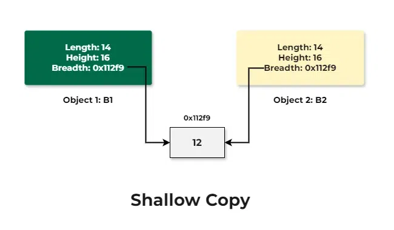
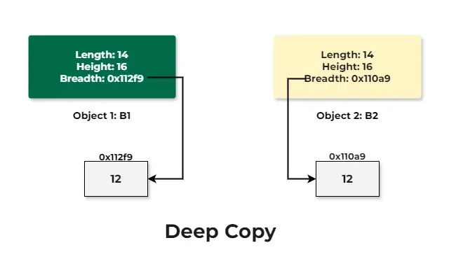

# Copy Constructor

A copy constructor is a member function that initializes an object using another object of the same class. Copy constructor takes a reference to an object of the same class as an argument.

```cpp
#include <iostream>
using namespace std;

class Demo {
public:
    int val; // data member

    // Parameterized constructor
    Demo(int x) {
        val = x;
    }
    
    // Copy constructor
    Demo(Demo &refObj) {
        val = refObj.val;
    }
};

int main() {
    Demo obj1(10);
    
    // Creating another object from obj1
    Demo obj2(obj1);
    
      cout << obj2.val;
    return 0;
}
```

## Shallow Copy and Deep Copy Constructor

In general, creating a copy of an object means to create an exact replica of the object having the same literal value, data type, and resources. There are two ways that are used by C++ compiler to create a copy of objects.

- Copy Constructor
- Assignment Operator


```cpp
Demo Obj1(Obj); // Copy Constructor
or
Demo Obj1 = Obj; // Copy Constructor

// Default assignment operator
Demo Obj2;  // Default Constructor
Obj2 = Obj1;
```

### Shallow Copy Constructor

#### What is Shallow Copy?
In shallow copy, an object is created by simply copying the data of all variables of the original object. This works well if none of the variables of the object are defined in the heap section of memory but if some variables are dynamically allocated memory from heap section, then the copied object variable will also reference the same memory location.

This will create ambiguity and run-time errors, dangling pointer. Since both objects will reference to the same memory location, then change made by one will reflect those change in another object as well. Since we wanted to create a replica of the object, this purpose will not be filled by Shallow copy. 



```cpp
#include <iostream>
using namespace std;

// Server Code
class Demo {
private:
    int length;
    int *breadth;
    int height;

public:
    // Function that sets the dimensions
    void set_dimensions(int length1, int breadth1,
                        int height1)
    {
        length = length1;
        breadth = new int;
        *breadth = breadth1;
        height = height1;
    }

    // Function to display the dimensions
    // of the Demo object
    void show_data()
    {
        cout << " Length = " << length
             << "\n Breadth = " << *breadth
             << "\n Breadth is pointing to " << breadth
             << "\n Height = " << height << endl;
        cout << "---------------------------"<<endl;
    }
};

// Client Code
int main()
{
    // Object of class Box
    Demo obj1;

    // Set dimensions of Box B1
    obj1.set_dimensions(14, 12, 16);
    obj1.show_data();

    // When copying the data of object
    // at the time of initialization
    // then copy is made through
    // COPY CONSTRUCTOR
    Demo obj2 = obj1;
    // Demo obj2(obj1);

    obj2.show_data();
    return 0;
}

```


#### What is Deep Copy?
In Deep copy, an object is created by copying data of all variables, and it also allocates similar memory resources with the same value to the object. In order to perform Deep copy, we need to explicitly define the copy constructor and assign dynamic memory as well, if required. Also, it is required to dynamically allocate memory to the variables in the other constructors, as well.

Consider the previous example again. If we deep copy the object, then each object will have their own copy of the data pointed by the breadth pointer.



```cpp
#include <iostream>
using namespace std;
class Demo {
private:
    int length;
    int *breadth;
    int height;

public:
    
    Demo()
    {
        breadth = new int;
    }

  Demo(Demo &refObj)
  {
    length = refObj.length;
    breadth = new int;
    *breadth = *(refObj.breadth);
    height = height;
  }

    // Function that sets the dimensions
    void set_dimensions(int length1, int breadth1,
                        int height1)
    {
        length = length1;
        *breadth = breadth1;
        height = height1;
    }

    // Function to display the dimensions
    // of the Demo object
    void show_data()
    {
        cout << " Length = " << length
             << "\n Breadth = " << *breadth
             << "\n Breadth is pointing to " << breadth
             << "\n Height = " << height << endl;
        cout<<"-----------------------"<<endl;
    }
};

// Client Code
int main()
{
    // Object of class Box
    Demo obj1;

    // Set dimensions of Box B1
    obj1.set_dimensions(14, 12, 16);
    obj1.show_data();

    // When copying the data of object
    // at the time of initialization
    // then copy is made through
    // COPY CONSTRUCTOR
    // Demo obj2 = obj1;
    Demo obj2(obj1);

    obj2.show_data();
    return 0;
}
```


<table><thead><tr><th style="text-align: center;"><span>&nbsp;S.No.</span></th><th><b><strong>Shallow Copy&nbsp;</strong></b></th><th><b><strong>Deep copy</strong></b></th></tr></thead><tbody><tr><th style="text-align: center;"><b><strong>1.</strong></b></th><td><span>When we create a copy of object by copying data of all member variables as it is, then it is called shallow copy&nbsp;</span></td><td><span>When we create an object by copying data of another object along with the values of memory resources that reside outside the object, then it is called a deep copy</span></td></tr><tr><th style="text-align: center;"><b><strong>2.</strong></b></th><td><span>A shallow copy of an object copies all of the member field values.</span></td><td><span>&nbsp;Deep copy is performed by implementing our own copy constructor.</span></td></tr><tr><th style="text-align: center;"><b><strong>3.</strong></b></th><td><span>In shallow copy, the two objects are not independent</span></td><td><span>It copies all fields, and makes copies of dynamically allocated memory pointed to by the fields</span></td></tr><tr><th style="text-align: center;"><b><strong>4.</strong></b></th><td><span>It also creates a copy of the dynamically allocated objects</span></td><td><span>If we do not create the deep copy in a rightful way then the copy will point to the original, with disastrous consequences.</span></td></tr></tbody></table>